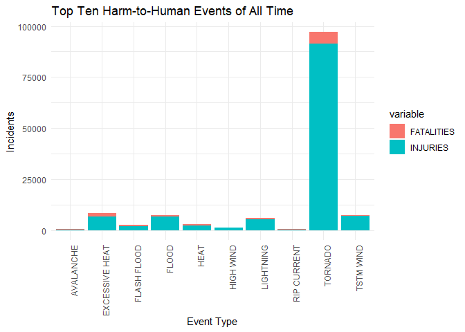
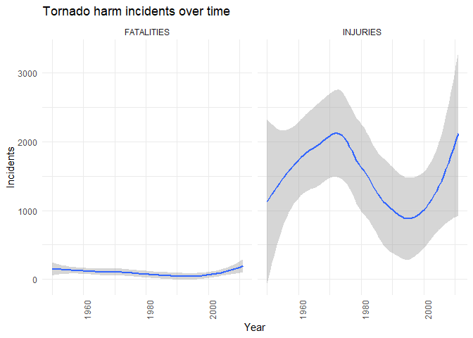
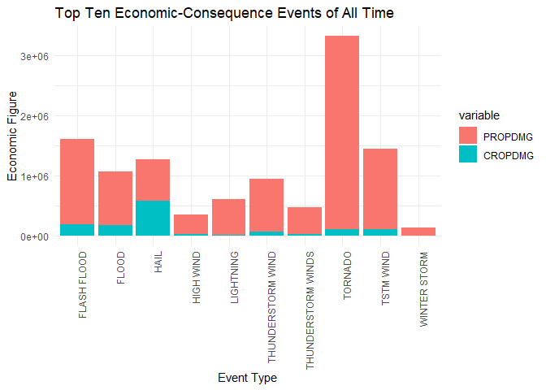

# Look into weather systems and their effects on public health using data analytical methods
### *For the Johns Hopkins Data Science Certificate offered through Coursera: Reproducible Research*

## Summary

The data from the NOAA Storm Database was imported and processed using (but not limited to) the tidyverse, and data.table packages in R.  A brief EDA showed the data table was in good form for analysis.  There were some necessary steps to process the data to make it tidy and clean.  For example, important categorical variables were factorized.  Finally, the data was visuallzied and assessed in two main categories.  Firstly, a look into harm to humans from these weather systems was performed by looking at which type of events caused the most injuries and fatalities to people.  Secondly, 

## Data Processing

The following describes the data processing performed prior to analysis of the data.

### Packages used for this analysis


```r
#install.packages("tidyverse")
#install.packages("data.table")
#install.packages("R.utils")
library(tidyverse)
library(data.table)
library(R.utils)
library(lubridate)
```

### Import Raw Data


```r
raw_storm_data <- fread("repdata_data_StormData.csv.bz2")
```

### EDA and Data Processing


```r
str(raw_storm_data)
head(raw_storm_data)

clean_storm_data <- raw_storm_data %>% 
  mutate(BGN_DATE = mdy_hms(BGN_DATE)) %>% 
  mutate(END_DATE = mdy_hms(END_DATE)) %>% 
  mutate(EVTYPE = as.factor(EVTYPE)) %>% 
  mutate(STATE = as.factor(STATE)) %>% 
  glimpse()

summary(clean_storm_data$INJURIES)
summary(clean_storm_data$FATALITIES)
unique(clean_storm_data$EVTYPE)
head(clean_storm_data)
```
Upon reviewing the data, it seemed necessary to convert date and time variables to date and time data types, using Lubridate.  As well, seeing that there were categorical variables, these columns were factorized. The reason for these transform was to simply enhance the data analytic process and not rely on the sorting of generic string data types.

## Results

### Analysis and Results for Harm to Humans due to adverse weahter systems


```r
harm_table <- clean_storm_data %>% 
  group_by(EVTYPE) %>% 
  summarise(FATALITIES = sum(FATALITIES), INJURIES = sum(INJURIES)) %>% 
  arrange(desc(FATALITIES)) %>% 
  slice(1:10)%>% 
  print()
```

```
## # A tibble: 10 x 3
##    EVTYPE         FATALITIES INJURIES
##    <fct>               <dbl>    <dbl>
##  1 TORNADO              5633    91346
##  2 EXCESSIVE HEAT       1903     6525
##  3 FLASH FLOOD           978     1777
##  4 HEAT                  937     2100
##  5 LIGHTNING             816     5230
##  6 TSTM WIND             504     6957
##  7 FLOOD                 470     6789
##  8 RIP CURRENT           368      232
##  9 HIGH WIND             248     1137
## 10 AVALANCHE             224      170
```

```r
harm_table_lg <- reshape2::melt(harm_table, id = "EVTYPE") %>% 
  print()
```

```
##            EVTYPE   variable value
## 1         TORNADO FATALITIES  5633
## 2  EXCESSIVE HEAT FATALITIES  1903
## 3     FLASH FLOOD FATALITIES   978
## 4            HEAT FATALITIES   937
## 5       LIGHTNING FATALITIES   816
## 6       TSTM WIND FATALITIES   504
## 7           FLOOD FATALITIES   470
## 8     RIP CURRENT FATALITIES   368
## 9       HIGH WIND FATALITIES   248
## 10      AVALANCHE FATALITIES   224
## 11        TORNADO   INJURIES 91346
## 12 EXCESSIVE HEAT   INJURIES  6525
## 13    FLASH FLOOD   INJURIES  1777
## 14           HEAT   INJURIES  2100
## 15      LIGHTNING   INJURIES  5230
## 16      TSTM WIND   INJURIES  6957
## 17          FLOOD   INJURIES  6789
## 18    RIP CURRENT   INJURIES   232
## 19      HIGH WIND   INJURIES  1137
## 20      AVALANCHE   INJURIES   170
```

```r
harm_visual <- ggplot(harm_table_lg)
harm_visual + 
  aes(x = EVTYPE, y = value, fill = variable) + 
  geom_col() +
  theme_minimal() +
  theme(axis.text.x=element_text(angle=90,hjust=1)) +
  labs(title = "Top Ten Harm-to-Human Events of All Time", x = "Event Type", y = "Incidents")
```

<!-- -->

As one can see, overwhelmingly tornadoes in the USA contribute to the most injuries and fatalities to human life.


```r
tornado_table <- clean_storm_data %>% 
  filter(EVTYPE == "TORNADO") %>% 
  mutate(BGN_DATE = year(BGN_DATE)) %>% 
  group_by(BGN_DATE) %>% 
  summarise(FATALITIES = sum(FATALITIES), INJURIES = sum(INJURIES)) %>% 
  print()
```

```
## # A tibble: 62 x 3
##    BGN_DATE FATALITIES INJURIES
##       <dbl>      <dbl>    <dbl>
##  1     1950         70      659
##  2     1951         34      524
##  3     1952        230     1915
##  4     1953        519     5131
##  5     1954         36      715
##  6     1955        129      926
##  7     1956         83     1355
##  8     1957        193     1976
##  9     1958         67      535
## 10     1959         58      734
## # ... with 52 more rows
```

```r
tornado_table_lg <- reshape2::melt(tornado_table, id = "BGN_DATE") %>% 
  print()
```

```
##     BGN_DATE   variable value
## 1       1950 FATALITIES    70
## 2       1951 FATALITIES    34
## 3       1952 FATALITIES   230
## 4       1953 FATALITIES   519
## 5       1954 FATALITIES    36
## 6       1955 FATALITIES   129
## 7       1956 FATALITIES    83
## 8       1957 FATALITIES   193
## 9       1958 FATALITIES    67
## 10      1959 FATALITIES    58
## 11      1960 FATALITIES    46
## 12      1961 FATALITIES    52
## 13      1962 FATALITIES    30
## 14      1963 FATALITIES    31
## 15      1964 FATALITIES    73
## 16      1965 FATALITIES   301
## 17      1966 FATALITIES    98
## 18      1967 FATALITIES   114
## 19      1968 FATALITIES   131
## 20      1969 FATALITIES    66
## 21      1970 FATALITIES    73
## 22      1971 FATALITIES   159
## 23      1972 FATALITIES    27
## 24      1973 FATALITIES    89
## 25      1974 FATALITIES   366
## 26      1975 FATALITIES    60
## 27      1976 FATALITIES    44
## 28      1977 FATALITIES    43
## 29      1978 FATALITIES    53
## 30      1979 FATALITIES    84
## 31      1980 FATALITIES    28
## 32      1981 FATALITIES    24
## 33      1982 FATALITIES    64
## 34      1983 FATALITIES    34
## 35      1984 FATALITIES   122
## 36      1985 FATALITIES    94
## 37      1986 FATALITIES    15
## 38      1987 FATALITIES    59
## 39      1988 FATALITIES    32
## 40      1989 FATALITIES    50
## 41      1990 FATALITIES    53
## 42      1991 FATALITIES    39
## 43      1992 FATALITIES    39
## 44      1993 FATALITIES    28
## 45      1994 FATALITIES    48
## 46      1995 FATALITIES    34
## 47      1996 FATALITIES    26
## 48      1997 FATALITIES    68
## 49      1998 FATALITIES   130
## 50      1999 FATALITIES    94
## 51      2000 FATALITIES    41
## 52      2001 FATALITIES    40
## 53      2002 FATALITIES    55
## 54      2003 FATALITIES    54
## 55      2004 FATALITIES    35
## 56      2005 FATALITIES    38
## 57      2006 FATALITIES    67
## 58      2007 FATALITIES    81
## 59      2008 FATALITIES   129
## 60      2009 FATALITIES    21
## 61      2010 FATALITIES    45
## 62      2011 FATALITIES   587
## 63      1950   INJURIES   659
## 64      1951   INJURIES   524
## 65      1952   INJURIES  1915
## 66      1953   INJURIES  5131
## 67      1954   INJURIES   715
## 68      1955   INJURIES   926
## 69      1956   INJURIES  1355
## 70      1957   INJURIES  1976
## 71      1958   INJURIES   535
## 72      1959   INJURIES   734
## 73      1960   INJURIES   737
## 74      1961   INJURIES  1087
## 75      1962   INJURIES   551
## 76      1963   INJURIES   538
## 77      1964   INJURIES  1148
## 78      1965   INJURIES  5197
## 79      1966   INJURIES  2030
## 80      1967   INJURIES  2144
## 81      1968   INJURIES  2522
## 82      1969   INJURIES  1311
## 83      1970   INJURIES  1355
## 84      1971   INJURIES  2723
## 85      1972   INJURIES   976
## 86      1973   INJURIES  2406
## 87      1974   INJURIES  6824
## 88      1975   INJURIES  1457
## 89      1976   INJURIES  1195
## 90      1977   INJURIES   771
## 91      1978   INJURIES   919
## 92      1979   INJURIES  3014
## 93      1980   INJURIES  1157
## 94      1981   INJURIES   798
## 95      1982   INJURIES  1276
## 96      1983   INJURIES   756
## 97      1984   INJURIES  2499
## 98      1985   INJURIES  1299
## 99      1986   INJURIES   536
## 100     1987   INJURIES  1018
## 101     1988   INJURIES   688
## 102     1989   INJURIES  1270
## 103     1990   INJURIES  1177
## 104     1991   INJURIES   864
## 105     1992   INJURIES  1323
## 106     1993   INJURIES   739
## 107     1994   INJURIES   806
## 108     1995   INJURIES  1098
## 109     1996   INJURIES   705
## 110     1997   INJURIES  1033
## 111     1998   INJURIES  1874
## 112     1999   INJURIES  1842
## 113     2000   INJURIES   882
## 114     2001   INJURIES   743
## 115     2002   INJURIES   968
## 116     2003   INJURIES  1087
## 117     2004   INJURIES   396
## 118     2005   INJURIES   537
## 119     2006   INJURIES   992
## 120     2007   INJURIES   659
## 121     2008   INJURIES  1690
## 122     2009   INJURIES   397
## 123     2010   INJURIES   699
## 124     2011   INJURIES  6163
```

```r
tornado_visual <- ggplot(tornado_table_lg)
tornado_visual + 
  aes(x = BGN_DATE, y = value) + 
  geom_smooth(method = "auto") +
  facet_grid(cols = vars(variable)) +
  theme_minimal() +
  theme(axis.text.x=element_text(angle=90,hjust=1)) +
  labs(title = "Tornado harm incidents over time", x = "Year", y = "Incidents")
```

<!-- -->

It seems there is no clear trend that incidents from tornados is decreasing over time.  In fact, it would seem incidents of injury are on the rise in recent years, same can be said for fatalities.


```r
glimpse(clean_storm_data)
```

```
## Observations: 902,297
## Variables: 37
## $ STATE__    <dbl> 1, 1, 1, 1, 1, 1, 1, 1, 1, 1, 1, 1, 1, 1, 1, 1, 1, ...
## $ BGN_DATE   <dttm> 1950-04-18, 1950-04-18, 1951-02-20, 1951-06-08, 19...
## $ BGN_TIME   <chr> "0130", "0145", "1600", "0900", "1500", "2000", "01...
## $ TIME_ZONE  <chr> "CST", "CST", "CST", "CST", "CST", "CST", "CST", "C...
## $ COUNTY     <dbl> 97, 3, 57, 89, 43, 77, 9, 123, 125, 57, 43, 9, 73, ...
## $ COUNTYNAME <chr> "MOBILE", "BALDWIN", "FAYETTE", "MADISON", "CULLMAN...
## $ STATE      <fct> AL, AL, AL, AL, AL, AL, AL, AL, AL, AL, AL, AL, AL,...
## $ EVTYPE     <fct> TORNADO, TORNADO, TORNADO, TORNADO, TORNADO, TORNAD...
## $ BGN_RANGE  <dbl> 0, 0, 0, 0, 0, 0, 0, 0, 0, 0, 0, 0, 0, 0, 0, 0, 0, ...
## $ BGN_AZI    <chr> "", "", "", "", "", "", "", "", "", "", "", "", "",...
## $ BGN_LOCATI <chr> "", "", "", "", "", "", "", "", "", "", "", "", "",...
## $ END_DATE   <dttm> NA, NA, NA, NA, NA, NA, NA, NA, NA, NA, NA, NA, NA...
## $ END_TIME   <chr> "", "", "", "", "", "", "", "", "", "", "", "", "",...
## $ COUNTY_END <dbl> 0, 0, 0, 0, 0, 0, 0, 0, 0, 0, 0, 0, 0, 0, 0, 0, 0, ...
## $ COUNTYENDN <lgl> NA, NA, NA, NA, NA, NA, NA, NA, NA, NA, NA, NA, NA,...
## $ END_RANGE  <dbl> 0, 0, 0, 0, 0, 0, 0, 0, 0, 0, 0, 0, 0, 0, 0, 0, 0, ...
## $ END_AZI    <chr> "", "", "", "", "", "", "", "", "", "", "", "", "",...
## $ END_LOCATI <chr> "", "", "", "", "", "", "", "", "", "", "", "", "",...
## $ LENGTH     <dbl> 14.0, 2.0, 0.1, 0.0, 0.0, 1.5, 1.5, 0.0, 3.3, 2.3, ...
## $ WIDTH      <dbl> 100, 150, 123, 100, 150, 177, 33, 33, 100, 100, 400...
## $ F          <int> 3, 2, 2, 2, 2, 2, 2, 1, 3, 3, 1, 1, 3, 3, 3, 4, 1, ...
## $ MAG        <dbl> 0, 0, 0, 0, 0, 0, 0, 0, 0, 0, 0, 0, 0, 0, 0, 0, 0, ...
## $ FATALITIES <dbl> 0, 0, 0, 0, 0, 0, 0, 0, 1, 0, 0, 0, 1, 0, 0, 4, 0, ...
## $ INJURIES   <dbl> 15, 0, 2, 2, 2, 6, 1, 0, 14, 0, 3, 3, 26, 12, 6, 50...
## $ PROPDMG    <dbl> 25.0, 2.5, 25.0, 2.5, 2.5, 2.5, 2.5, 2.5, 25.0, 25....
## $ PROPDMGEXP <chr> "K", "K", "K", "K", "K", "K", "K", "K", "K", "K", "...
## $ CROPDMG    <dbl> 0, 0, 0, 0, 0, 0, 0, 0, 0, 0, 0, 0, 0, 0, 0, 0, 0, ...
## $ CROPDMGEXP <chr> "", "", "", "", "", "", "", "", "", "", "", "", "",...
## $ WFO        <chr> "", "", "", "", "", "", "", "", "", "", "", "", "",...
## $ STATEOFFIC <chr> "", "", "", "", "", "", "", "", "", "", "", "", "",...
## $ ZONENAMES  <chr> "", "", "", "", "", "", "", "", "", "", "", "", "",...
## $ LATITUDE   <dbl> 3040, 3042, 3340, 3458, 3412, 3450, 3405, 3255, 333...
## $ LONGITUDE  <dbl> 8812, 8755, 8742, 8626, 8642, 8748, 8631, 8558, 874...
## $ LATITUDE_E <dbl> 3051, 0, 0, 0, 0, 0, 0, 0, 3336, 3337, 3402, 3404, ...
## $ LONGITUDE_ <dbl> 8806, 0, 0, 0, 0, 0, 0, 0, 8738, 8737, 8644, 8640, ...
## $ REMARKS    <chr> "", "", "", "", "", "", "", "", "", "", "", "", "",...
## $ REFNUM     <dbl> 1, 2, 3, 4, 5, 6, 7, 8, 9, 10, 11, 12, 13, 14, 15, ...
```

```r
econ_conseq_table <- clean_storm_data %>% 
  group_by(EVTYPE) %>% 
  summarise(PROPDMG = sum(PROPDMG), CROPDMG = sum(CROPDMG)) %>% 
  mutate(TOTAL_DMG = PROPDMG + CROPDMG) %>% 
  arrange(desc(TOTAL_DMG)) %>% 
  slice(1:10)%>% 
  print()
```

```
## # A tibble: 10 x 4
##    EVTYPE              PROPDMG CROPDMG TOTAL_DMG
##    <fct>                 <dbl>   <dbl>     <dbl>
##  1 TORNADO            3212258. 100019.  3312277.
##  2 FLASH FLOOD        1420125. 179200.  1599325.
##  3 TSTM WIND          1335966. 109203.  1445168.
##  4 HAIL                688693. 579596.  1268290.
##  5 FLOOD               899938. 168038.  1067976.
##  6 THUNDERSTORM WIND   876844.  66791.   943636.
##  7 LIGHTNING           603352.   3581.   606932.
##  8 THUNDERSTORM WINDS  446293.  18685.   464978.
##  9 HIGH WIND           324732.  17283.   342015.
## 10 WINTER STORM        132721.   1979.   134700.
```

```r
econ_conseq_table_lg <- reshape2::melt(econ_conseq_table[,1:3], id = "EVTYPE") %>% 
  print()
```

```
##                EVTYPE variable      value
## 1             TORNADO  PROPDMG 3212258.16
## 2         FLASH FLOOD  PROPDMG 1420124.59
## 3           TSTM WIND  PROPDMG 1335965.61
## 4                HAIL  PROPDMG  688693.38
## 5               FLOOD  PROPDMG  899938.48
## 6   THUNDERSTORM WIND  PROPDMG  876844.17
## 7           LIGHTNING  PROPDMG  603351.78
## 8  THUNDERSTORM WINDS  PROPDMG  446293.18
## 9           HIGH WIND  PROPDMG  324731.56
## 10       WINTER STORM  PROPDMG  132720.59
## 11            TORNADO  CROPDMG  100018.52
## 12        FLASH FLOOD  CROPDMG  179200.46
## 13          TSTM WIND  CROPDMG  109202.60
## 14               HAIL  CROPDMG  579596.28
## 15              FLOOD  CROPDMG  168037.88
## 16  THUNDERSTORM WIND  CROPDMG   66791.45
## 17          LIGHTNING  CROPDMG    3580.61
## 18 THUNDERSTORM WINDS  CROPDMG   18684.93
## 19          HIGH WIND  CROPDMG   17283.21
## 20       WINTER STORM  CROPDMG    1978.99
```

```r
econ_conseq_visual <- ggplot(econ_conseq_table_lg)
econ_conseq_visual + 
  aes(x = EVTYPE, y = value, fill = variable) + 
  geom_col() +
  theme_minimal() +
  theme(axis.text.x=element_text(angle=90,hjust=1)) +
  labs(title = "Top Ten Economic-Consequence Events of All Time", x = "Event Type", y = "Economic Figure")
```

<!-- -->

When analyzing economic consequences, it seems as well, tornados are, again, overwhelmingly responsible for the most adverse economic consequences in the USA.

